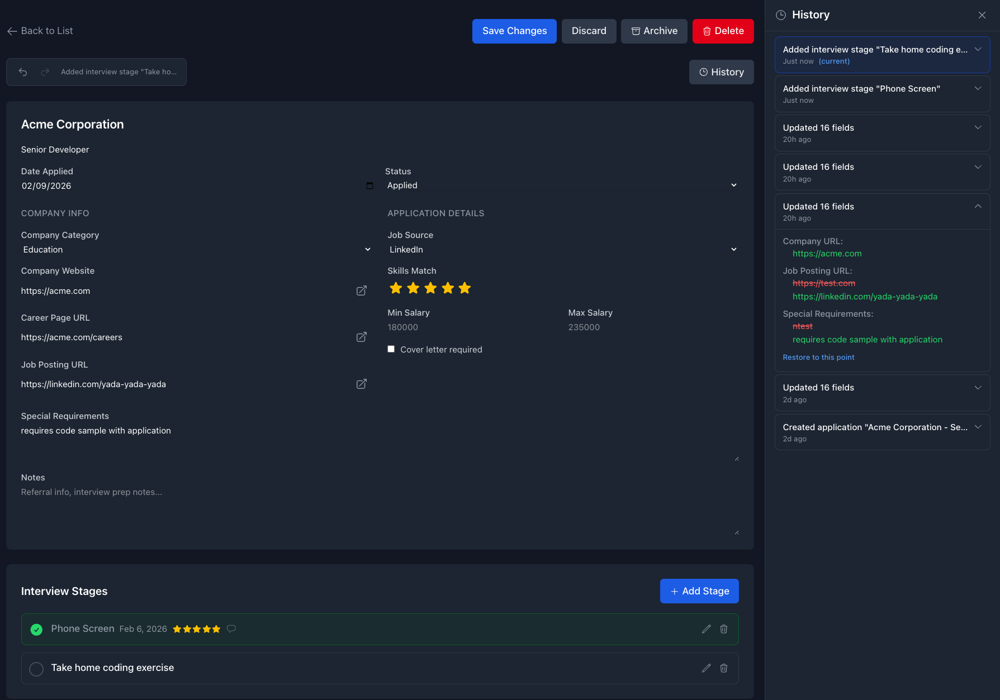

# Job Application Tracker

A full-stack job application tracking system with multiple technology stack implementations.

- [Overview](#overview)
  - [Sample Editing screen](#sample-editing-screen)
- [Implementations](#implementations)
  - [1. Vue + Nuxt + Drizzle](#1-vue--nuxt--drizzle)
  - [2. Next.js + Express + Prisma](#2-nextjs--express--prisma)
  - [3. React + Koa + PostgreSQL](#3-react--koa--postgresql)
  - [4. Svelte + Hono + Drizzle](#4-svelte--hono--drizzle)
  - [5. React + TanStack + NestJS + Drizzle](#5-react--tanstack--nestjs--drizzle)
  - [6. React SSR + TanStack Start + FastAPI](#6-react-ssr--tanstack-start--fastapi)
  - [7. Angular + Go Gin + pgx/sqlc](#7-angular--go-gin--pgxsqlc)
  - [8. Angular + Spring Boot + JPA/Hibernate](#8-angular--spring-boot--jpahibernate)
  - [9. GraphQL Yoga + React Apollo](#9-graphql-yoga--react-apollo)
  - [10. Lambda + DynamoDB (API only)](#10-lambda--dynamodb-api-only)
  - [11. Lambda React UI + Lambda API + DynamoDB](#11-lambda-react-ui--lambda-api--dynamodb)
  - [12. Ruby on Rails API](#12-ruby-on-rails-api)
- [Core Features](#core-features)
- [Database Architecture](#database-architecture)
- [Service Communication](#service-communication)
- [Type Diagrams](#type-diagrams)
- [Repository Structure](#repository-structure)
- [Getting Started](#getting-started)
  - [Prerequisites](#prerequisites)
  - [Installation](#installation)
  - [Running Applications](#running-applications)
  - [Schema Documentation](#schema-documentation)
- [Testing](#testing)
  - [Unit Tests](#unit-tests)
  - [API Integration Tests](#api-integration-tests)
  - [End-to-End Tests](#end-to-end-tests)
  - [Build Verification](#build-verification)
  - [Per-Stack Validation](#per-stack-validation)
  - [CI Workflows](#ci-workflows)
- [Codebase Knowledge Graphs](#codebase-knowledge-graphs)
  - [Viewing a Graph](#viewing-a-graph)
  - [Domain Analysis (Business Flows)](#domain-analysis-business-flows)
- [Development Tools](#development-tools)
  - [Skills](#skills)
  - [VS Code Debug Configurations](#vs-code-debug-configurations)
  - [Notifications (Optional)](#notifications-optional)
- [License](#license)


## Overview

This repository contains a complete job application tracker built with multiple full-stack implementations. Each provides the same core functionality and user experience, allowing you to compare technology stacks side by side.

### Sample Editing screen



## Implementations

| Implementation | Directories | UI Port | API Port | Notes |
|---|---|---:|---:|---|
| Vue + Nuxt + Drizzle | `vue-ui/` + `nuxt-api/` | 3020 | 5040 | PostgreSQL (`vue_nuxt`) |
| Next.js + Express + Prisma | `ui/` + `api/` | 3000 | 3001 | PostgreSQL (`express_prisma`) |
| React + Koa + PostgreSQL | `react-ui/` + `koa-api/` | 3010 | 5010 | Raw SQL (`react_koa`) |
| Svelte + Hono + Drizzle | `svelte-ui/` + `hono-api/` | 3030 | 5030 | PostgreSQL (`svelte_hono`) |
| React + TanStack + NestJS + Drizzle | `tanstack-ui/` + `nest-api/` | 3050 | 5050 | PostgreSQL (`react_nestjs`) |
| React SSR + TanStack Start + FastAPI | `tanstack-start-ui/` + `fastapi/` | 3040 | 5160 | PostgreSQL (`python_fastapi`) |
| Angular + Go Gin + pgx/sqlc | `angular-ui/` + `go-api/` | 3060 | 5070 | PostgreSQL (`go_gin`) |
| Angular + Spring Boot + JPA/Hibernate | `angular-spring-ui/` + `spring-api/` | 3070 | 8080 | PostgreSQL (`java_spring`) |
| GraphQL Yoga + React Apollo | `react-apollo-ui/` + `yoga-api/` | 3080 | 5080 | PostgreSQL (`graphql_yoga`) |
| Lambda + DynamoDB (API only) | `lambda-api/` | - | 5090 | DynamoDB (`lambda_api_applications`) |
| Lambda React UI + Lambda API + DynamoDB | `lambda-react-ui/` + `lambda-api/` | 3090 | 5090 | Zustand + React 19 + Vite, DynamoDB-backed |
| Ruby on Rails API | `rails-api/` | - | 5180 | PostgreSQL (`ruby_rails`) |

### 1. Vue + Nuxt + Drizzle
**Directories**: `vue-ui/` + `nuxt-api/`
**Stack**:
- Frontend: Vue 3 + Pinia + TypeScript + Vite + Tailwind CSS
- Backend: Nuxt server routes
- Database: Drizzle ORM + PostgreSQL
- Event sourcing with Immer patches, undo/redo, history panel with diff view, patch-based restores, and checkpoint snapshots — see [sequence diagram](docs/vue-nuxt-history.mermaid)

### 2. Next.js + Express + Prisma
**Directories**: `ui/` + `api/`
**Stack**:
- Frontend: Next.js + React 19 + TypeScript + Tailwind CSS
- Backend: Express.js + Prisma ORM
- Database: PostgreSQL

### 3. React + Koa + PostgreSQL
**Directories**: `react-ui/` + `koa-api/`
**Stack**:
- Frontend: React 19 + TypeScript + Vite + Tailwind CSS
- Backend: Koa.js + raw PostgreSQL (no ORM)
- Database: PostgreSQL with SQL migrations

### 4. Svelte + Hono + Drizzle
**Directories**: `svelte-ui/` + `hono-api/`
**Stack**:
- Frontend: Svelte 5 + SvelteKit + Tailwind CSS
- Backend: Hono (lightweight framework)
- Database: Drizzle ORM + PostgreSQL

### 5. React + TanStack + NestJS + Drizzle
**Directories**: `tanstack-ui/` + `nest-api/` + `nest-history-api/`
**Stack**:
- Frontend: React 19 + TanStack Query v5 + TanStack Router + TypeScript + Vite + Tailwind CSS
- Backend: NestJS with Fastify adapter; history delegated to `nest-history-api` over gRPC
- Database: Drizzle ORM + PostgreSQL (`react_nestjs`); history in `react_nestjs_history` (Knex)
- Snapshot-based history with field diffs and restore
- Service communication via Protocol Buffers + gRPC ([`proto/history/v1/history.proto`](proto/history/v1/history.proto)); types generated with `buf` + `ts-proto`

### 6. React SSR + TanStack Start + FastAPI
**Directories**: `tanstack-start-ui/` + `fastapi/`
**Stack**:
- Frontend: React 19 + TanStack Start (SSR) + TanStack Query v5 + TanStack Router + Tailwind CSS
- Backend: Python 3.14 + FastAPI + Pydantic v2
- Database: asyncpg (raw SQL, no ORM) via `python_fastapi` schema
- Server-side rendering with route loaders and `createServerFn` server functions
- Snapshot-based history with field diffs and restore

### 7. Angular + Go Gin + pgx/sqlc
**Directories**: `angular-ui/` + `go-api/`
**Stack**:
- Frontend: Angular 21 + standalone components + Angular Signals + Tailwind CSS 4.x — port 3060
- Backend: Go 1.24 + Gin framework + pgx v5 + sqlc for type-safe SQL — port 5070
- Database: PostgreSQL via `go_gin` schema (raw SQL, no ORM)
- Angular Signals for reactive state, CanDeactivate guard for unsaved changes
- Snapshot-based history with field diffs and restore
- testcontainers-go integration tests

### 8. Angular + Spring Boot + JPA/Hibernate
**Directories**: `angular-spring-ui/` + `spring-api/`
**Stack**:
- Frontend: Angular 21 + standalone components + Angular Signals + Tailwind CSS 4.x — port 3070
- Backend: Java 21 + Spring Boot 3.4.x + Spring Data JPA + Hibernate 6 + Flyway — port 8080
- Database: PostgreSQL via `java_spring` schema (JPA entities + Flyway migrations)
- AttributeConverter classes for PostgreSQL enum types with hyphenated values
- Snapshot-based history with field diffs and restore
- Gradle 8.x (Kotlin DSL) build system

### 9. GraphQL Yoga + React Apollo
**Directories**: `react-apollo-ui/` + `yoga-api/`
**Stack**:
- Frontend: React 19 + Apollo Client 3 + TanStack Router + TypeScript + Vite + Tailwind CSS — port 3080
- Backend: GraphQL Yoga 5 + Pothos schema builder + Prisma ORM — port 5080
- Database: PostgreSQL via `graphql_yoga` schema (Prisma migrations)
- GraphQL API with full query/mutation support for applications, stages, and history
- Snapshot-based history with field diffs and restore

### 10. Lambda + DynamoDB (API only)
**Directory**: `lambda-api/`
**Stack**:
- Backend: TypeScript + Hono + AWS Lambda + DynamoDB — port 5090 (local)
- Database: DynamoDB (single-table design, `lambda_api_applications` table) — **no PostgreSQL**
- Local development: Hono runs directly via `@hono/node-server`; DynamoDB Local via Docker
- Lambda deployment: same Hono app wrapped with `@hono/aws-lambda` adapter
- Infrastructure: AWS CDK (TypeScript) at `lambda-api/cdk/` — DynamoDB + Lambda + HTTP API Gateway v2
- First serverless, non-relational backend in the monorepo

### 11. Lambda React UI + Lambda API + DynamoDB
**Directories**: `lambda-react-ui/` + `lambda-api/`
**Stack**:
- Frontend: React 19 + TypeScript + Vite + Zustand + React Router — port 3090
- Backend: TypeScript + Hono + AWS Lambda-compatible runtime (local dev server) — port 5090
- Database: DynamoDB single-table design (`lambda_api_applications`) via `lambda-api` endpoints only
- Includes responsive three-pane UI, context panel workflows, CSV import/export, history diff view, and shared E2E compatibility

### 12. Ruby on Rails API
**Directory**: `rails-api/`
**Stack**:
- Backend: Ruby 3.3+ + Rails API mode + ActiveRecord — port 5180
- Database: PostgreSQL via `ruby_rails` schema (Rails migrations)
- API-only first pass; UI parity and CSV import/export are deferred follow-ups
- Snapshot-based history with field diffs and restore

## Core Features

All implementations provide:
- Full CRUD operations for job applications
- Interview stage tracking
- Filtering by status, category, source, skills rating
- Sorting and pagination
- Archive/restore functionality
- Dark mode support
- Responsive design (desktop + mobile)
- Input validation and error handling

## Database Architecture

All implementations share a single PostgreSQL database (`app_tracker`) with separate schemas for isolation:

| Schema | Apps | ERD |
|--------|------|-----|
| `vue_nuxt` | Vue + Nuxt + Drizzle | [schema docs](docs/schema/vue-nuxt/README.md) |
| `express_prisma` | Next.js + Express + Prisma | [schema docs](docs/schema/express-prisma/README.md) |
| `react_koa` | React + Koa + PostgreSQL | [schema docs](docs/schema/react-koa/README.md) |
| `svelte_hono` | Svelte + Hono + Drizzle | [schema docs](docs/schema/svelte-hono/README.md) |
| `react_nestjs` | React + TanStack + NestJS + Drizzle | [schema docs](docs/schema/react-nestjs/README.md) |
| `react_nestjs_history` | NestJS gRPC History Service | [schema docs](docs/schema/react-nestjs-history/README.md) |
| `python_fastapi` | React SSR + TanStack Start + FastAPI | [schema docs](docs/schema/python-fastapi/README.md) |
| `go_gin` | Angular + Go Gin API | [schema docs](docs/schema/go-gin/README.md) |
| `java_spring` | Angular + Spring Boot + JPA | [schema docs](docs/schema/java-spring/README.md) |
| `graphql_yoga` | GraphQL Yoga + React Apollo | [schema docs](docs/schema/graphql-yoga/README.md) |
| `ruby_rails` | Ruby on Rails API | [schema docs](docs/schema/ruby-rails/README.md) |

**DynamoDB (non-relational):**

| Table | Apps | Notes |
|-------|------|-------|
| `lambda_api_applications` | Lambda + DynamoDB API + Lambda React UI | Single-table design with GSIs; no PostgreSQL — [schema docs](docs/schema/lambda-api/README.md) |

See [docs/DATABASE_ARCHITECTURE.md](docs/DATABASE_ARCHITECTURE.md) for ORM setup and connection string patterns.

## Service Communication

The React + TanStack + NestJS stack demonstrates microservice communication using **gRPC and Protocol Buffers**:

- **`nest-api`** — public REST edge (port 5050); handles all HTTP requests from the browser
- **`nest-history-api`** — internal gRPC microservice (port 50051); owns the `react_nestjs_history` schema and all history persistence

History writes (create, restore) and reads flow from `nest-api` → gRPC → `nest-history-api`. The browser-facing REST contract is unchanged — the gRPC transport is entirely internal.

**Proto contract**: [`proto/history/v1/history.proto`](proto/history/v1/history.proto) — governed by [`buf`](https://buf.build); TypeScript types generated via [`ts-proto`](https://github.com/stephenh/ts-proto).

```bash
npm run proto:lint      # lint .proto files with buf
npm run proto:breaking  # check for breaking changes against main
npm run proto:generate  # regenerate TypeScript types from .proto
```

## Type Diagrams

Mermaid class diagrams generated from TypeScript type definitions:
- [nuxt-api](docs/types/nuxt-api/types.mermaid) - Vue + Nuxt (includes event sourcing types)
- [ui](docs/types/ui/application.mermaid) - Next.js + Express
- [react-ui](docs/types/react-ui/application.mermaid) - React + Koa
- [koa-api](docs/types/koa-api/index.mermaid) - Koa API (partial - Zod-inferred types unresolved)
- [svelte-ui](docs/types/svelte-ui/index.mermaid) - Svelte + Hono
- [tanstack-ui](docs/types/tanstack-ui/application.mermaid) - React + TanStack + NestJS
- [nest-api](docs/types/nest-api/api.mermaid) - NestJS API
- [tanstack-start-ui](docs/types/tanstack-start-ui/application.mermaid) - React SSR + TanStack Start
- [angular-ui](docs/types/angular-ui/application.model.mermaid) - Angular + Go Gin
- [angular-spring-ui](docs/types/angular-spring-ui/application.model.mermaid) - Angular + Spring Boot
- [react-apollo-ui](docs/types/react-apollo-ui/application.mermaid) - React Apollo + GraphQL Yoga
- [yoga-api](docs/types/yoga-api/application.service.mermaid) - GraphQL Yoga API (service input/filter types)
- [lambda-api](docs/types/lambda-api/api.mermaid) - Lambda + DynamoDB API *(hand-maintained — `ts-to-mermaid` does not support zod)*

Regenerate with `npm run docs:types` (all stacks except lambda-api, which is hand-maintained).

## Repository Structure

```
/
├── ui/                           # Next.js + React UI
├── api/                          # Express + Prisma API
├── react-ui/                     # React + Vite UI
├── koa-api/                      # Koa + PostgreSQL API
├── svelte-ui/                    # SvelteKit UI
├── hono-api/                     # Hono API
├── vue-ui/                       # Vue + Vite UI
├── tanstack-ui/                  # React + TanStack Query/Router UI
├── tanstack-start-ui/            # React SSR + TanStack Start UI
├── angular-ui/                   # Angular 21 UI (Go Gin backend)
├── angular-spring-ui/            # Angular 21 UI (Spring Boot backend)
├── spring-api/                   # Spring Boot 3.4 API
├── nest-api/                     # NestJS + Fastify API
├── nest-history-api/             # NestJS gRPC History Microservice (port 50051)
├── nuxt-api/                     # Nuxt server API
├── fastapi/                      # Python FastAPI API
├── go-api/                       # Go Gin API
├── lambda-api/                   # AWS Lambda + DynamoDB API
├── rails-api/                    # Ruby on Rails API
├── proto/                        # Protocol Buffer definitions (buf + ts-proto)
├── specs/                        # Feature specifications
├── docs/                         # Documentation
├── .claude/                      # Claude Code skills and commands
├── CLAUDE.md                     # Repository instructions for Claude Code
└── docker-compose.yml            # Docker + PostgreSQL setup
```

## Getting Started

### Prerequisites

- Node.js (v18+)
- Python 3.12+ and [uv](https://docs.astral.sh/uv/) (for the FastAPI implementation)
- Go 1.24+ (for the Go Gin API implementation) — ensure `$(go env GOPATH)/bin` (typically `~/go/bin`) appears in your `PATH` before system package manager paths so locally-installed Go tools (`govulncheck`, `gotestsum`) take precedence
- Java 21 (for the Spring Boot implementation) — Eclipse Temurin is recommended: `brew install --cask temurin@21`
- Ruby 3.3+ and Bundler (for the Rails API implementation)
- Docker and Docker Compose (for PostgreSQL)
- [tbls](https://github.com/k1LoW/tbls) (optional, for regenerating schema docs): `brew install tbls`

### Installation

1. Clone the repository:
   ```bash
   git clone https://github.com/WhatIfWeDigDeeper/application-tracker.git
   cd application-tracker
   ```

2. Install dependencies for all implementations:
   ```bash
   npm run ci:all
   ```

3. Start PostgreSQL:
   ```bash
   docker-compose up -d postgres
   ```

4. Run database migrations for each implementation you intend to use:
   ```bash
   npm run migrate:express        # Express + Prisma
   npm run migrate:koa-api        # Koa (raw SQL)
   npm run migrate:hono-api       # Hono + Drizzle
   npm run migrate:nuxt-api       # Nuxt + Drizzle
   npm run migrate:nest-api          # NestJS + Drizzle
   npm run migrate:nest-history-api  # NestJS gRPC History Service (Knex)
   npm run migrate:fastapi        # FastAPI (asyncpg)
   npm run migrate:go             # Go Gin API (raw SQL)
   npm run migrate:spring-api     # Spring Boot API (Flyway — auto-run on startup too)
   npm run migrate:rails-api      # Rails API (ActiveRecord migrations)

   # or all at once:
   npm run migrate:all
   ```

### Running Applications

Each implementation can be run independently:

```bash
# Next.js + Express (UI 3000 + API 3001)
npm run dev:react-next-ui
npm run dev:express-api

# React + Koa (UI 3010 + API 5010)
npm run dev:react-ui
npm run dev:koa-api

# Vue + Nuxt (UI 3020 + API 5040)
npm run dev:vue-ui
npm run dev:nuxt-api

# Svelte + Hono (UI 3030 + API 5030)
npm run dev:svelte-ui
npm run dev:hono-api

# React + TanStack + NestJS (UI 3050 + API 5050 + gRPC History 50051)
npm run dev:nest-history-api  # start gRPC history microservice first
npm run dev:nest-api
npm run dev:tanstack-ui

# React SSR + TanStack Start + FastAPI (UI 3040 + API 5160)
npm run dev:tanstack-start-ui
npm run dev:fastapi

# Angular + Go Gin (UI 3060 + API 5070)
npm run dev:go-api
npm run dev:angular-ui

# Angular + Spring Boot (UI 3070 + API 8080)
npm run dev:spring-api
npm run dev:angular-spring-ui

# Lambda + DynamoDB (API only — port 5090)
# Requires DynamoDB Local: docker compose up -d dynamodb-local
cp lambda-api/.env.example lambda-api/.env  # sets DYNAMODB_ENDPOINT/local AWS creds for DynamoDB Local
npm run migrate:lambda-api                  # create/update DynamoDB table
npm run dev:lambda-api                      # start Hono server on port 5090

# Lambda React UI + Lambda API (UI 3090 + API 5090)
npm run dev:lambda-api
npm run dev:lambda-react-ui

# Ruby on Rails API (API only — port 5180)
npm run dev:rails-api

# CDK — synthesize / deploy (real AWS or LocalStack)
npm run cdk:synth                           # synthesize CloudFormation template (no AWS needed)
npm run cdk:deploy                          # deploy to real AWS
docker compose --profile localstack up -d localstack  # start LocalStack (opt-in)
npm run cdk:deploy:local                    # deploy to LocalStack
```

### Schema Documentation

Regenerate database ERD docs after schema changes (requires [tbls](https://github.com/k1LoW/tbls) and a running PostgreSQL instance):

```bash
npm run docs:schema
```

This generates Mermaid ERDs and per-table documentation under `docs/schema/` for each implementation schema.

## Testing

### Unit Tests

Run tests for individual implementations:

```bash
npm run test:express-api  # Express + Prisma API tests
npm run test:react-next-ui  # Next.js UI tests
npm run test:koa-api      # Koa API tests
npm run test:react-ui     # React UI tests
npm run test:svelte-ui    # Svelte UI tests
npm run test:vue-ui       # Vue UI tests
npm run test:nest-api     # NestJS API tests
npm run test:tanstack-ui  # TanStack UI tests
npm run test:tanstack-start-ui  # TanStack Start UI tests
npm run test:fastapi      # FastAPI pytest unit tests
npm run test:go-api       # Go Gin API integration tests (testcontainers-go)
npm run test:angular-ui   # Angular UI tests (Jest + @testing-library/angular)
npm run test:spring-api   # Spring Boot API tests (JUnit 5)
npm run test:angular-spring-ui  # Angular Spring UI tests (Jest + @testing-library/angular)
npm run test:lambda-api         # Lambda + DynamoDB unit tests (vitest, no Docker needed)
npm run test:lambda-react-ui    # Lambda React UI tests (Vitest + Testing Library)
npm run test:lambda-api-cdk     # CDK assertions tests (vitest, no Docker needed)
npm run test:rails-api          # Rails API tests (RSpec)
```

Run all unit tests:

```bash
npm run test:all          # Run all implementation tests
```

### API Integration Tests

Cross-stack API tests run Jest integration tests against each REST API backend. Implementations are tested with a shared test suite covering CRUD, date formats, CSV import/export for CSV-capable stacks, history, and application status.

Run tests for a single API (requires the API server to be running):

```bash
npm run test:api:express-api   # Express + Prisma API (port 3001)
npm run test:api:koa-api       # Koa API (port 5010)
npm run test:api:nuxt-api      # Nuxt server API (port 5040)
npm run test:api:hono-api      # Hono API (port 5030)
npm run test:api:fastapi       # FastAPI (port 5160)
npm run test:api:nest-api      # NestJS API (port 5050)
npm run test:api:go-api        # Go Gin API (port 5070)
npm run test:api:spring-api    # Spring Boot API (port 8080)
npm run test:api:yoga-api      # GraphQL Yoga REST API (port 5080)
npm run test:api:lambda-api    # Lambda + DynamoDB API (port 5090)
npm run test:api:rails-api     # Rails API (port 5180)
```

Run all API tests with automatic server lifecycle management:

```bash
npm run test:api:all           # Start all APIs, run tests, stop APIs
# or
bash scripts/run-api-tests.sh
```

### End-to-End Tests

E2E tests use Playwright and run against each implementation:

```bash
npm run test:e2e:react-next-ui      # Next.js + Express (port 3000)
npm run test:e2e:react-ui           # React + Koa (port 3010)
npm run test:e2e:vue-ui             # Vue + Nuxt (port 3020)
npm run test:e2e:svelte-ui          # Svelte + Hono (port 3030)
npm run test:e2e:tanstack-start-ui  # React SSR + TanStack Start + FastAPI (port 3040)
npm run test:e2e:tanstack-ui        # React + TanStack + NestJS (port 3050)
npm run test:e2e:angular-ui         # Angular + Go Gin (port 3060)
npm run test:e2e:angular-spring-ui  # Angular + Spring Boot (port 3070)
npm run test:e2e:lambda-react-ui    # Lambda React UI + Lambda API (port 3090)
npm run test:e2e:all                # Run all e2e tests
```

To clean up leftover test data from interrupted runs, see [Test Data Cleanup](docs/TESTING_REFERENCE.md#test-data-cleanup).

To remove orphaned Docker containers left behind by Go test runs (`TESTCONTAINERS_RYUK_DISABLED=true`), run `npm run cleanup:docker`.

### Build Verification

Build all implementations:

```bash
npm run build:all         # Build all implementations
```

### Per-Stack Validation

Run the full validation chain (install → audit → lint → build → migrate → test) for a single stack:

```bash
npm run validate:tanstack-ui      # install → audit:ci → lint → build → migrate (--if-present) → test
npm run validate:express-api
npm run validate:nest-history-api
# ... validate:<stack> available for all stacks
```

Run everything across all stacks:

```bash
npm run validate:all
```

### CI Workflows

The **Claude Code Review** workflow (`claude-code-review`) is triggered manually — it does not run automatically on pull requests. To run it, go to **Actions → Claude Code Review → Run workflow** and enter the PR number.

## Codebase Knowledge Graphs

Each stack directory has a navigable knowledge graph produced by the [understand-anything](https://github.com/WhatIfWeDigDeeper/understand-anything) plugin. Graphs map files, functions, classes, and their relationships into architectural layers with a guided tour for onboarding.

| Stack | Directory |
|-------|-----------|
| Lambda API (Hono/DynamoDB) | `lambda-api/` |
| Lambda React UI | `lambda-react-ui/` |
| Express API (Prisma) | `api/` |
| Koa API | `koa-api/` |
| React UI | `react-ui/` |
| Vue UI | `vue-ui/` |
| Nuxt API (Drizzle) | `nuxt-api/` |
| Hono API (Drizzle) | `hono-api/` |
| SvelteKit UI | `svelte-ui/` |
| NestJS API (Drizzle) | `nest-api/` |
| TanStack Router UI | `tanstack-ui/` |
| TanStack Start SSR UI | `tanstack-start-ui/` |
| FastAPI (Python) | `fastapi/` |
| Angular UI | `angular-ui/` |
| Go Gin API | `go-api/` |
| Spring Boot API | `spring-api/` |
| GraphQL Yoga API | `yoga-api/` |
| React Apollo UI | `react-apollo-ui/` |
| NestJS gRPC History API | `nest-history-api/` |
| Ruby on Rails API | `rails-api/` |

### Viewing a Graph

The dashboard requires the [understand-anything](https://github.com/WhatIfWeDigDeeper/understand-anything) plugin. Once installed, launch it for any analyzed stack:

```bash
PLUGIN=/Users/<you>/.claude/plugins/cache/understand-anything/understand-anything/<version>
cd $PLUGIN/packages/dashboard
GRAPH_DIR=/path/to/application-tracker/<stack-dir> npx vite --host 127.0.0.1
```

The server prints a tokenized URL — open the full URL including `?token=<TOKEN>` in your browser.

### Domain Analysis (Business Flows)

Run `/understand-anything:understand-domain` in Claude Code from any stack directory to generate a `domain-graph.json` that maps business flows and their steps. Domain graphs are generated on demand and are not committed alongside the knowledge graphs.

For a single stack:

```
/understand-anything:understand-domain lambda-api
/understand-anything:understand-domain react-ui
```

See [specs/029-understand-codebase-graphs/spec.md](specs/029-understand-codebase-graphs/spec.md) for full details.

## Development Tools

This repository includes Claude Code commands and skills for common development tasks:

- `/commit` - Generate commit messages
- `/pr` - Create pull requests
- `/fix-build` - Fix build errors

### Skills

Skills installed from [WhatIfWeDigDeeper/agent-skills](https://github.com/WhatIfWeDigDeeper/agent-skills?tab=readme-ov-file#installation):

| Skill | Description |
|-------|-------------|
| `js-deps` | Update npm dependencies and/or fix audit errors |
| `uv-deps` | Audit and update Python dependencies |
| `ship-it` | Branch, commit, push, and open a PR |
| `pr-comments` | Address review comments on a pull request |
| `vercel-react-best-practices` | React/Next.js performance optimization guidelines from Vercel Engineering |
| `mermaid-diagrams` | Generate Mermaid diagrams (flowcharts, sequence, ERD, C4, and more) |

Since `npx skills check` and `npx skills update` apparently do not work with the above repo at this time, you may force update all skills:

```bash
npx skills add -y https://github.com/whatifwedigdeeper/agent-skills
```

Other skills

```bash
npx skills add -y https://github.com/microsoft/playwright-cli --skill playwright-cli
```

```bash
npx skills add -y https://github.com/vercel-labs/agent-skills --skill vercel-react-best-practices
```


See [.claude/](.claude/) for all available commands and skills.

### VS Code Debug Configurations

`.vscode/launch.json` includes debug configurations for all API backends. Open the **Run and Debug** panel (`Ctrl+Shift+D` / `Cmd+Shift+D`) and select the server you want to debug:

| Configuration | Port |
|---------------|------|
| Express API | 5000 |
| Koa API | 5010 |
| Hono API | 5030 |
| Nuxt API | 5040 |
| NestJS API | 5050 |
| FastAPI | 5160 |
| Go Gin API | 5070 |

FastAPI debugging requires the [Python](https://marketplace.visualstudio.com/items?itemName=ms-python.python) extension. Go debugging requires the [Go](https://marketplace.visualstudio.com/items?itemName=golang.go) extension.

### Notifications (Optional)

Claude Code hooks in `.claude/settings.json` send macOS notifications when Claude needs input (permission prompts, questions, idle). This requires [terminal-notifier](https://github.com/julienXX/terminal-notifier):

```bash
brew install terminal-notifier
```

After installing, grant notification permissions so alerts appear:

**System Settings → Notifications → terminal-notifier → Allow Notifications**

No other configuration needed — the hooks are already in `.claude/settings.json`. If you don't install it, hooks fail silently with no impact.

## License

MIT
