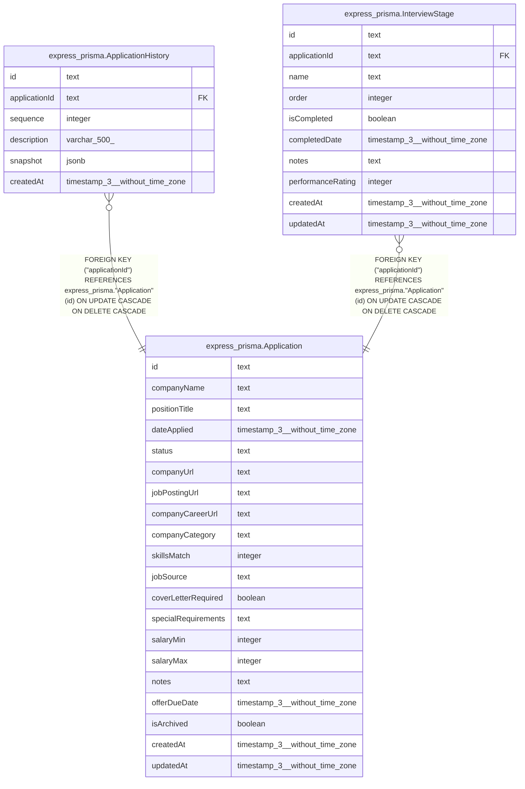

# express_prisma.Application

## Columns

| Name | Type | Default | Nullable | Children | Parents | Comment |
| ---- | ---- | ------- | -------- | -------- | ------- | ------- |
| id | text |  | false | [express_prisma.ApplicationHistory](express_prisma.ApplicationHistory.md) [express_prisma.InterviewStage](express_prisma.InterviewStage.md) |  |  |
| companyName | text |  | false |  |  |  |
| positionTitle | text |  | false |  |  |  |
| dateApplied | timestamp(3) without time zone |  | true |  |  |  |
| status | text | 'unsubmitted'::text | false |  |  |  |
| companyUrl | text |  | true |  |  |  |
| jobPostingUrl | text |  | true |  |  |  |
| companyCareerUrl | text |  | true |  |  |  |
| companyCategory | text |  | true |  |  |  |
| skillsMatch | integer |  | true |  |  |  |
| jobSource | text |  | true |  |  |  |
| coverLetterRequired | boolean |  | true |  |  |  |
| specialRequirements | text |  | true |  |  |  |
| salaryMin | integer |  | true |  |  |  |
| salaryMax | integer |  | true |  |  |  |
| notes | text |  | true |  |  |  |
| offerDueDate | timestamp(3) without time zone |  | true |  |  |  |
| isArchived | boolean | false | false |  |  |  |
| createdAt | timestamp(3) without time zone | CURRENT_TIMESTAMP | false |  |  |  |
| updatedAt | timestamp(3) without time zone |  | false |  |  |  |

## Constraints

| Name | Type | Definition |
| ---- | ---- | ---------- |
| Application_companyName_not_null | n | NOT NULL "companyName" |
| Application_createdAt_not_null | n | NOT NULL "createdAt" |
| Application_id_not_null | n | NOT NULL id |
| Application_isArchived_not_null | n | NOT NULL "isArchived" |
| Application_positionTitle_not_null | n | NOT NULL "positionTitle" |
| Application_status_not_null | n | NOT NULL status |
| Application_updatedAt_not_null | n | NOT NULL "updatedAt" |
| Application_pkey | PRIMARY KEY | PRIMARY KEY (id) |

## Indexes

| Name | Definition |
| ---- | ---------- |
| Application_pkey | CREATE UNIQUE INDEX "Application_pkey" ON express_prisma."Application" USING btree (id) |
| Application_status_idx | CREATE INDEX "Application_status_idx" ON express_prisma."Application" USING btree (status) |
| Application_isArchived_idx | CREATE INDEX "Application_isArchived_idx" ON express_prisma."Application" USING btree ("isArchived") |

## Relations

---

> Generated by [tbls](https://github.com/k1LoW/tbls)
