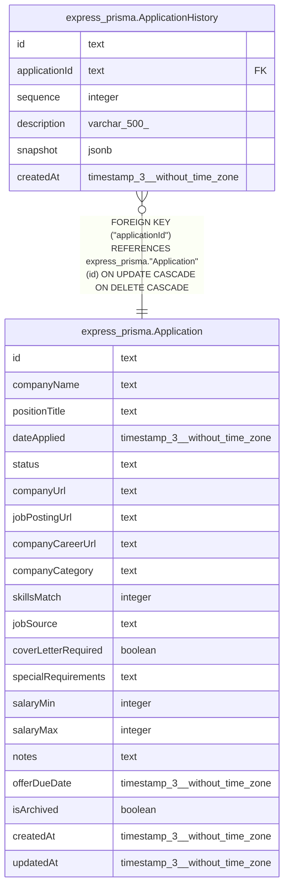

# express_prisma.ApplicationHistory

## Columns

| Name | Type | Default | Nullable | Children | Parents | Comment |
| ---- | ---- | ------- | -------- | -------- | ------- | ------- |
| id | text |  | false |  |  |  |
| applicationId | text |  | false |  | [express_prisma.Application](express_prisma.Application.md) |  |
| sequence | integer |  | false |  |  |  |
| description | varchar(500) |  | false |  |  |  |
| snapshot | jsonb |  | false |  |  |  |
| createdAt | timestamp(3) without time zone | CURRENT_TIMESTAMP | false |  |  |  |

## Constraints

| Name | Type | Definition |
| ---- | ---- | ---------- |
| ApplicationHistory_applicationId_not_null | n | NOT NULL "applicationId" |
| ApplicationHistory_createdAt_not_null | n | NOT NULL "createdAt" |
| ApplicationHistory_description_not_null | n | NOT NULL description |
| ApplicationHistory_id_not_null | n | NOT NULL id |
| ApplicationHistory_sequence_not_null | n | NOT NULL sequence |
| ApplicationHistory_snapshot_not_null | n | NOT NULL snapshot |
| ApplicationHistory_applicationId_fkey | FOREIGN KEY | FOREIGN KEY ("applicationId") REFERENCES express_prisma."Application"(id) ON UPDATE CASCADE ON DELETE CASCADE |
| ApplicationHistory_pkey | PRIMARY KEY | PRIMARY KEY (id) |

## Indexes

| Name | Definition |
| ---- | ---------- |
| ApplicationHistory_pkey | CREATE UNIQUE INDEX "ApplicationHistory_pkey" ON express_prisma."ApplicationHistory" USING btree (id) |
| ApplicationHistory_applicationId_sequence_idx | CREATE INDEX "ApplicationHistory_applicationId_sequence_idx" ON express_prisma."ApplicationHistory" USING btree ("applicationId", sequence) |

## Relations

---

> Generated by [tbls](https://github.com/k1LoW/tbls)
