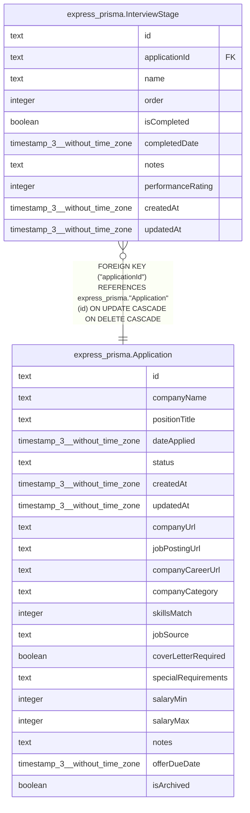

# express_prisma.InterviewStage

## Description

## Columns

| Name | Type | Default | Nullable | Children | Parents | Comment |
| ---- | ---- | ------- | -------- | -------- | ------- | ------- |
| id | text |  | false |  |  |  |
| applicationId | text |  | false |  | [express_prisma.Application](express_prisma.Application.md) |  |
| name | text |  | false |  |  |  |
| order | integer |  | false |  |  |  |
| isCompleted | boolean | false | false |  |  |  |
| completedDate | timestamp(3) without time zone |  | true |  |  |  |
| notes | text |  | true |  |  |  |
| performanceRating | integer |  | true |  |  |  |
| createdAt | timestamp(3) without time zone | CURRENT_TIMESTAMP | false |  |  |  |
| updatedAt | timestamp(3) without time zone |  | false |  |  |  |

## Constraints

| Name | Type | Definition |
| ---- | ---- | ---------- |
| InterviewStage_applicationId_not_null | n | NOT NULL "applicationId" |
| InterviewStage_createdAt_not_null | n | NOT NULL "createdAt" |
| InterviewStage_id_not_null | n | NOT NULL id |
| InterviewStage_isCompleted_not_null | n | NOT NULL "isCompleted" |
| InterviewStage_name_not_null | n | NOT NULL name |
| InterviewStage_order_not_null | n | NOT NULL "order" |
| InterviewStage_updatedAt_not_null | n | NOT NULL "updatedAt" |
| InterviewStage_applicationId_fkey | FOREIGN KEY | FOREIGN KEY ("applicationId") REFERENCES express_prisma."Application"(id) ON UPDATE CASCADE ON DELETE CASCADE |
| InterviewStage_pkey | PRIMARY KEY | PRIMARY KEY (id) |

## Indexes

| Name | Definition |
| ---- | ---------- |
| InterviewStage_pkey | CREATE UNIQUE INDEX "InterviewStage_pkey" ON express_prisma."InterviewStage" USING btree (id) |
| InterviewStage_applicationId_idx | CREATE INDEX "InterviewStage_applicationId_idx" ON express_prisma."InterviewStage" USING btree ("applicationId") |

## Relations

---

> Generated by [tbls](https://github.com/k1LoW/tbls)
