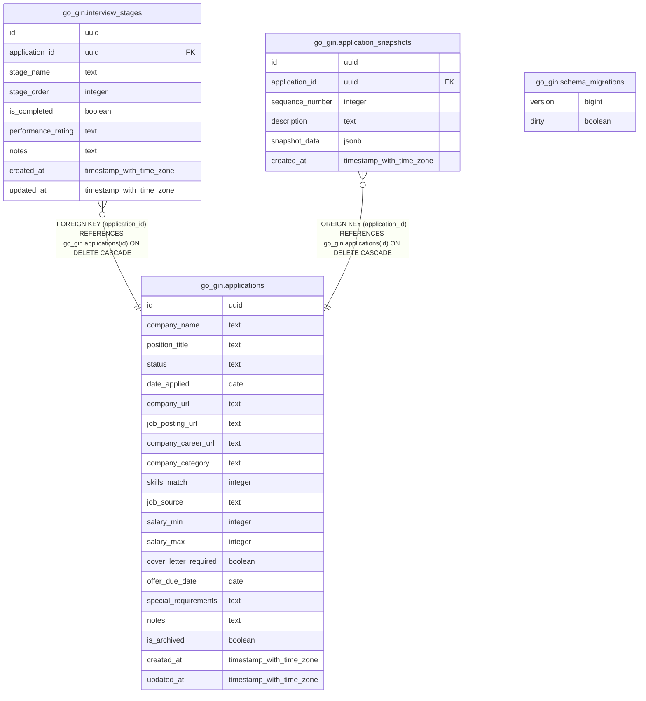

# app_tracker

## Tables

| Name | Columns | Comment | Type |
| ---- | ------- | ------- | ---- |
| [go_gin.applications](go_gin.applications.md) | 20 |  | BASE TABLE |
| [go_gin.interview_stages](go_gin.interview_stages.md) | 9 |  | BASE TABLE |
| [go_gin.application_snapshots](go_gin.application_snapshots.md) | 6 |  | BASE TABLE |
| [go_gin.schema_migrations](go_gin.schema_migrations.md) | 2 |  | BASE TABLE |

## Relations

---

> Generated by [tbls](https://github.com/k1LoW/tbls)
