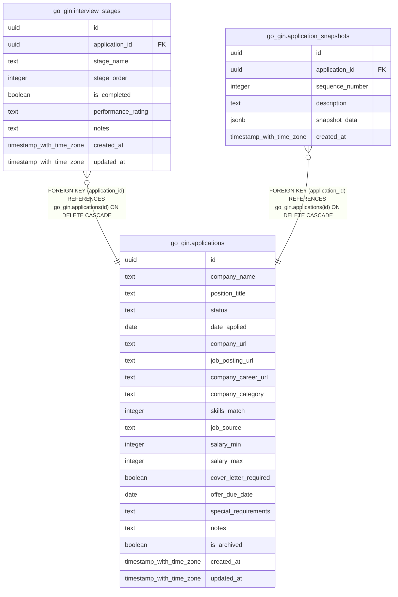

# go_gin.applications

## Description

## Columns

| Name | Type | Default | Nullable | Children | Parents | Comment |
| ---- | ---- | ------- | -------- | -------- | ------- | ------- |
| id | uuid | gen_random_uuid() | false | [go_gin.interview_stages](go_gin.interview_stages.md) [go_gin.application_snapshots](go_gin.application_snapshots.md) |  |  |
| company_name | text |  | false |  |  |  |
| position_title | text |  | false |  |  |  |
| status | text | 'unsubmitted'::text | false |  |  |  |
| date_applied | date |  | true |  |  |  |
| company_url | text |  | true |  |  |  |
| job_posting_url | text |  | true |  |  |  |
| company_career_url | text |  | true |  |  |  |
| company_category | text |  | true |  |  |  |
| skills_match | integer |  | true |  |  |  |
| job_source | text |  | true |  |  |  |
| salary_min | integer |  | true |  |  |  |
| salary_max | integer |  | true |  |  |  |
| cover_letter_required | boolean | false | false |  |  |  |
| offer_due_date | date |  | true |  |  |  |
| special_requirements | text |  | true |  |  |  |
| notes | text |  | true |  |  |  |
| is_archived | boolean | false | false |  |  |  |
| created_at | timestamp with time zone | now() | false |  |  |  |
| updated_at | timestamp with time zone | now() | false |  |  |  |

## Constraints

| Name | Type | Definition |
| ---- | ---- | ---------- |
| applications_company_category_check | CHECK | CHECK ((company_category = ANY (ARRAY['education'::text, 'health'::text, 'climate'::text, 'ai'::text, 'energy'::text, 'finance'::text, 'enterprise-software'::text, 'consumer-tech'::text, 'e-commerce'::text, 'cybersecurity'::text, 'gaming'::text, 'media-entertainment'::text, 'consulting'::text, 'government'::text, 'nonprofit'::text, 'retail'::text, 'restaurant'::text, 'hospitality'::text, 'other'::text]))) |
| applications_company_name_not_null | n | NOT NULL company_name |
| applications_cover_letter_required_not_null | n | NOT NULL cover_letter_required |
| applications_created_at_not_null | n | NOT NULL created_at |
| applications_id_not_null | n | NOT NULL id |
| applications_is_archived_not_null | n | NOT NULL is_archived |
| applications_job_source_check | CHECK | CHECK ((job_source = ANY (ARRAY['recruiter'::text, 'linkedin'::text, 'indeed'::text, 'friend'::text, 'colleague'::text, 'company-website'::text, 'other'::text]))) |
| applications_position_title_not_null | n | NOT NULL position_title |
| applications_skills_match_check | CHECK | CHECK (((skills_match >= 1) AND (skills_match <= 5))) |
| applications_status_check | CHECK | CHECK ((status = ANY (ARRAY['unsubmitted'::text, 'applied'::text, 'phone_screen'::text, 'interviewing'::text, 'offer'::text, 'rejected'::text, 'withdrawn'::text, 'accepted'::text]))) |
| applications_status_not_null | n | NOT NULL status |
| applications_updated_at_not_null | n | NOT NULL updated_at |
| applications_pkey | PRIMARY KEY | PRIMARY KEY (id) |

## Indexes

| Name | Definition |
| ---- | ---------- |
| applications_pkey | CREATE UNIQUE INDEX applications_pkey ON go_gin.applications USING btree (id) |

## Relations

---

> Generated by [tbls](https://github.com/k1LoW/tbls)
