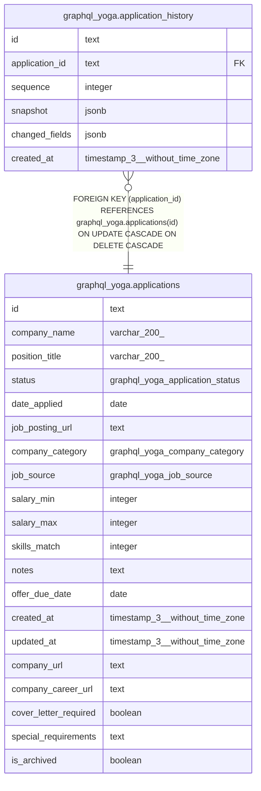

# graphql_yoga.application_history

## Columns

| Name | Type | Default | Nullable | Children | Parents | Comment |
| ---- | ---- | ------- | -------- | -------- | ------- | ------- |
| id | text |  | false |  |  |  |
| application_id | text |  | false |  | [graphql_yoga.applications](graphql_yoga.applications.md) |  |
| sequence | integer |  | false |  |  |  |
| snapshot | jsonb |  | false |  |  |  |
| changed_fields | jsonb |  | false |  |  |  |
| created_at | timestamp(3) without time zone | CURRENT_TIMESTAMP | false |  |  |  |

## Constraints

| Name | Type | Definition |
| ---- | ---- | ---------- |
| application_history_application_id_not_null | n | NOT NULL application_id |
| application_history_changed_fields_not_null | n | NOT NULL changed_fields |
| application_history_created_at_not_null | n | NOT NULL created_at |
| application_history_id_not_null | n | NOT NULL id |
| application_history_sequence_not_null | n | NOT NULL sequence |
| application_history_snapshot_not_null | n | NOT NULL snapshot |
| application_history_application_id_fkey | FOREIGN KEY | FOREIGN KEY (application_id) REFERENCES graphql_yoga.applications(id) ON UPDATE CASCADE ON DELETE CASCADE |
| application_history_pkey | PRIMARY KEY | PRIMARY KEY (id) |

## Indexes

| Name | Definition |
| ---- | ---------- |
| application_history_pkey | CREATE UNIQUE INDEX application_history_pkey ON graphql_yoga.application_history USING btree (id) |
| application_history_application_id_sequence_key | CREATE UNIQUE INDEX application_history_application_id_sequence_key ON graphql_yoga.application_history USING btree (application_id, sequence) |

## Relations

---

> Generated by [tbls](https://github.com/k1LoW/tbls)
