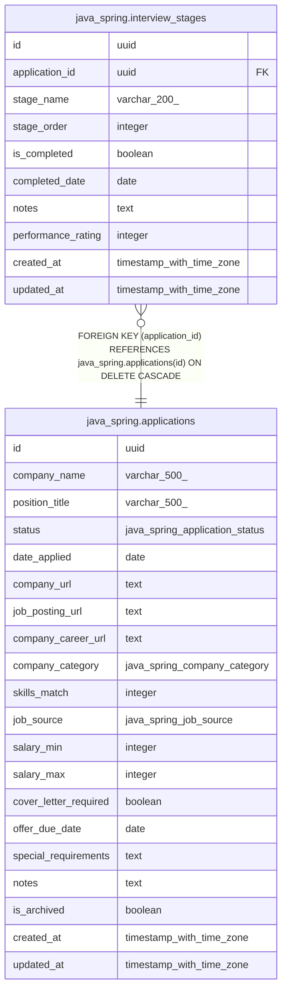

# java_spring.interview_stages

## Columns

| Name | Type | Default | Nullable | Children | Parents | Comment |
| ---- | ---- | ------- | -------- | -------- | ------- | ------- |
| id | uuid | gen_random_uuid() | false |  |  |  |
| application_id | uuid |  | false |  | [java_spring.applications](java_spring.applications.md) |  |
| stage_name | varchar(200) |  | false |  |  |  |
| stage_order | integer | 0 | false |  |  |  |
| is_completed | boolean | false | false |  |  |  |
| completed_date | date |  | true |  |  |  |
| notes | text |  | true |  |  |  |
| performance_rating | integer |  | true |  |  |  |
| created_at | timestamp with time zone | now() | false |  |  |  |
| updated_at | timestamp with time zone | now() | false |  |  |  |

## Constraints

| Name | Type | Definition |
| ---- | ---- | ---------- |
| interview_stages_application_id_not_null | n | NOT NULL application_id |
| interview_stages_created_at_not_null | n | NOT NULL created_at |
| interview_stages_id_not_null | n | NOT NULL id |
| interview_stages_is_completed_not_null | n | NOT NULL is_completed |
| interview_stages_performance_rating_check | CHECK | CHECK (((performance_rating >= 1) AND (performance_rating <= 5))) |
| interview_stages_stage_name_not_null | n | NOT NULL stage_name |
| interview_stages_stage_order_not_null | n | NOT NULL stage_order |
| interview_stages_updated_at_not_null | n | NOT NULL updated_at |
| interview_stages_application_id_fkey | FOREIGN KEY | FOREIGN KEY (application_id) REFERENCES java_spring.applications(id) ON DELETE CASCADE |
| interview_stages_pkey | PRIMARY KEY | PRIMARY KEY (id) |

## Indexes

| Name | Definition |
| ---- | ---------- |
| interview_stages_pkey | CREATE UNIQUE INDEX interview_stages_pkey ON java_spring.interview_stages USING btree (id) |
| idx_interview_stages_application_id | CREATE INDEX idx_interview_stages_application_id ON java_spring.interview_stages USING btree (application_id) |

## Relations

---

> Generated by [tbls](https://github.com/k1LoW/tbls)
