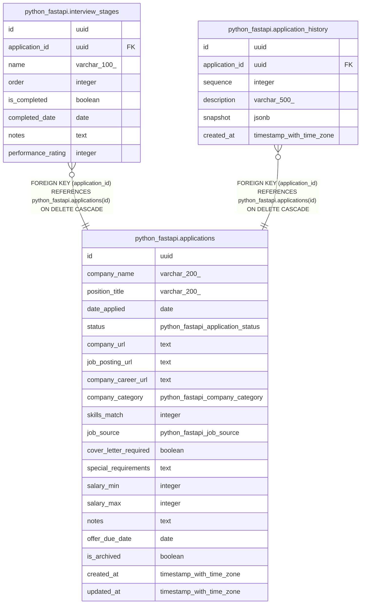

# app_tracker

## Tables

| Name | Columns | Comment | Type |
| ---- | ------- | ------- | ---- |
| [python_fastapi.applications](python_fastapi.applications.md) | 20 |  | BASE TABLE |
| [python_fastapi.interview_stages](python_fastapi.interview_stages.md) | 8 |  | BASE TABLE |
| [python_fastapi.application_history](python_fastapi.application_history.md) | 6 |  | BASE TABLE |

## Enums

| Name | Values |
| ---- | ------- |
| python_fastapi.application_status | accepted offer, applied, declined offer, given offer, interviewing, no offer, rejected, unsubmitted |
| python_fastapi.company_category | ai, climate, consulting, consumer-tech, cybersecurity, e-commerce, education, energy, enterprise-software, finance, gaming, government, health, hospitality, media-entertainment, nonprofit, other, restaurant, retail |
| python_fastapi.job_source | colleague, company-website, friend, indeed, linkedin, other, recruiter |

## Relations

---

> Generated by [tbls](https://github.com/k1LoW/tbls)
