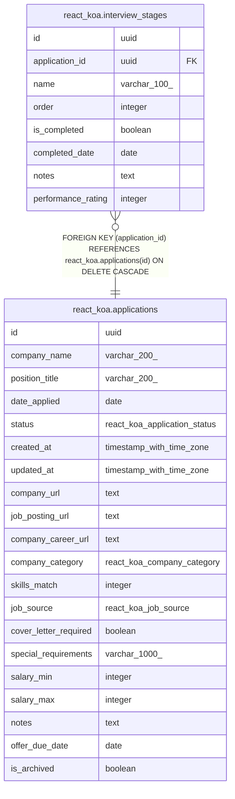

# react_koa.interview_stages

## Columns

| Name | Type | Default | Nullable | Children | Parents | Comment |
| ---- | ---- | ------- | -------- | -------- | ------- | ------- |
| id | uuid | react_koa.uuid_generate_v4() | false |  |  |  |
| application_id | uuid |  | false |  | [react_koa.applications](react_koa.applications.md) |  |
| name | varchar(100) |  | false |  |  |  |
| order | integer | 0 | false |  |  |  |
| is_completed | boolean | false | false |  |  |  |
| completed_date | date |  | true |  |  |  |
| notes | text |  | true |  |  |  |
| performance_rating | integer |  | true |  |  |  |

## Constraints

| Name | Type | Definition |
| ---- | ---- | ---------- |
| interview_stages_application_id_not_null | n | NOT NULL application_id |
| interview_stages_id_not_null | n | NOT NULL id |
| interview_stages_is_completed_not_null | n | NOT NULL is_completed |
| interview_stages_name_not_null | n | NOT NULL name |
| interview_stages_notes_check | CHECK | CHECK (((notes IS NULL) OR (length(notes) <= 2000))) |
| interview_stages_order_not_null | n | NOT NULL "order" |
| interview_stages_performance_rating_check | CHECK | CHECK (((performance_rating IS NULL) OR ((performance_rating >= 1) AND (performance_rating <= 5)))) |
| interview_stages_application_id_fkey | FOREIGN KEY | FOREIGN KEY (application_id) REFERENCES react_koa.applications(id) ON DELETE CASCADE |
| interview_stages_pkey | PRIMARY KEY | PRIMARY KEY (id) |

## Indexes

| Name | Definition |
| ---- | ---------- |
| interview_stages_pkey | CREATE UNIQUE INDEX interview_stages_pkey ON react_koa.interview_stages USING btree (id) |
| idx_interview_stages_application_id | CREATE INDEX idx_interview_stages_application_id ON react_koa.interview_stages USING btree (application_id) |
| idx_interview_stages_order | CREATE INDEX idx_interview_stages_order ON react_koa.interview_stages USING btree (application_id, "order") |

## Relations

---

> Generated by [tbls](https://github.com/k1LoW/tbls)
