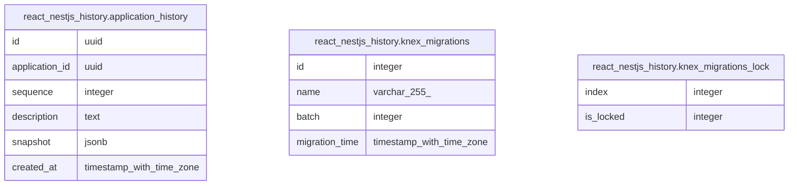

# app_tracker

## Tables

| Name | Columns | Comment | Type |
| ---- | ------- | ------- | ---- |
| [react_nestjs_history.application_history](react_nestjs_history.application_history.md) | 6 |  | BASE TABLE |
| [react_nestjs_history.knex_migrations](react_nestjs_history.knex_migrations.md) | 4 |  | BASE TABLE |
| [react_nestjs_history.knex_migrations_lock](react_nestjs_history.knex_migrations_lock.md) | 2 |  | BASE TABLE |

## Relations

---

> Generated by [tbls](https://github.com/k1LoW/tbls)
