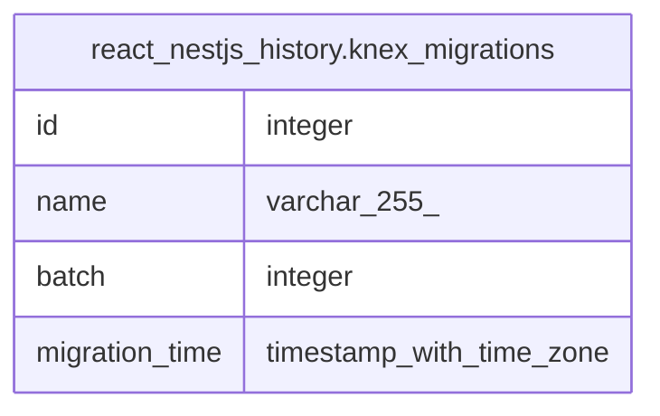

# react_nestjs_history.knex_migrations

## Columns

| Name | Type | Default | Nullable | Children | Parents | Comment |
| ---- | ---- | ------- | -------- | -------- | ------- | ------- |
| id | integer | nextval('react_nestjs_history.knex_migrations_id_seq'::regclass) | false |  |  |  |
| name | varchar(255) |  | true |  |  |  |
| batch | integer |  | true |  |  |  |
| migration_time | timestamp with time zone |  | true |  |  |  |

## Constraints

| Name | Type | Definition |
| ---- | ---- | ---------- |
| knex_migrations_id_not_null | n | NOT NULL id |
| knex_migrations_pkey | PRIMARY KEY | PRIMARY KEY (id) |

## Indexes

| Name | Definition |
| ---- | ---------- |
| knex_migrations_pkey | CREATE UNIQUE INDEX knex_migrations_pkey ON react_nestjs_history.knex_migrations USING btree (id) |

## Relations

---

> Generated by [tbls](https://github.com/k1LoW/tbls)
