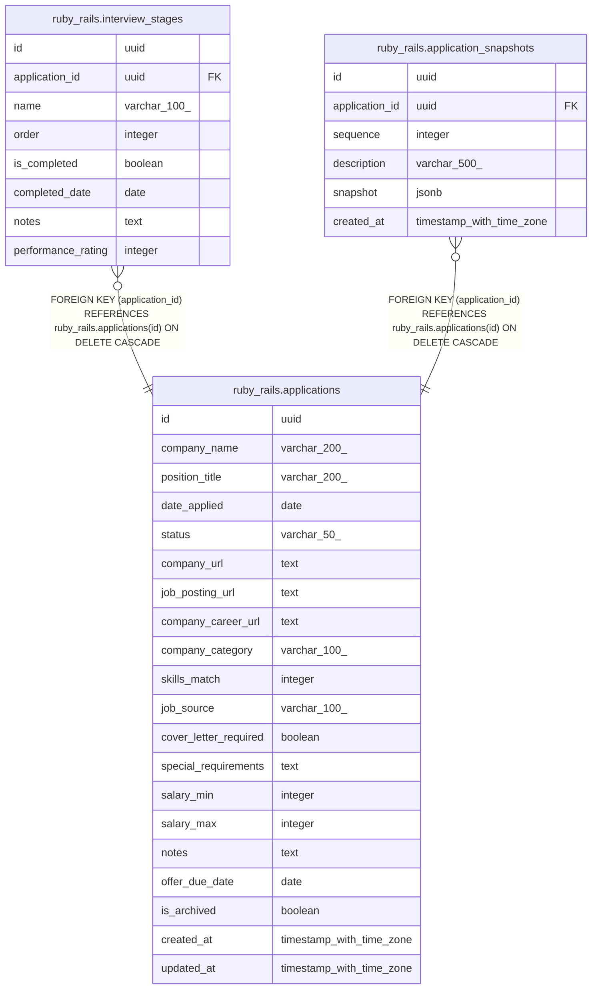

# app_tracker

## Tables

| Name | Columns | Comment | Type |
| ---- | ------- | ------- | ---- |
| [ruby_rails.applications](ruby_rails.applications.md) | 20 |  | BASE TABLE |
| [ruby_rails.interview_stages](ruby_rails.interview_stages.md) | 8 |  | BASE TABLE |
| [ruby_rails.application_snapshots](ruby_rails.application_snapshots.md) | 6 |  | BASE TABLE |

## Enums

| Name | Values |
| ---- | ------- |
| express_prisma.ApplicationStatus | accepted, applied, interviewing, offered, rejected, unsubmitted |
| express_prisma.CompanyCategory | enterprise, mid_market, other, scale_up, startup |
| express_prisma.JobSource | company_website, job_board, other, recruiter, referral |
| graphql_yoga.application_status | accepted offer, applied, declined offer, given offer, interviewing, no offer, rejected, unsubmitted |
| graphql_yoga.company_category | ai, climate, consulting, consumer-tech, cybersecurity, e-commerce, education, energy, enterprise-software, finance, gaming, government, health, hospitality, media-entertainment, nonprofit, other, restaurant, retail |
| graphql_yoga.job_source | colleague, company-website, friend, indeed, linkedin, other, recruiter |
| java_spring.application_status | accepted offer, applied, declined offer, given offer, interviewing, no offer, rejected, unsubmitted |
| java_spring.company_category | ai, climate, consulting, consumer-tech, cybersecurity, e-commerce, education, energy, enterprise-software, finance, gaming, government, health, hospitality, media-entertainment, nonprofit, other, restaurant, retail |
| java_spring.job_source | colleague, company-website, friend, indeed, linkedin, other, recruiter |
| python_fastapi.application_status | accepted offer, applied, declined offer, given offer, interviewing, no offer, rejected, unsubmitted |
| python_fastapi.company_category | ai, climate, consulting, consumer-tech, cybersecurity, e-commerce, education, energy, enterprise-software, finance, gaming, government, health, hospitality, media-entertainment, nonprofit, other, restaurant, retail |
| python_fastapi.job_source | colleague, company-website, friend, indeed, linkedin, other, recruiter |
| react_koa.application_status | accepted offer, applied, declined offer, given offer, interviewing, no offer, rejected, unsubmitted |
| react_koa.company_category | ai, climate, consulting, consumer-tech, cybersecurity, e-commerce, education, energy, enterprise-software, finance, gaming, government, health, hospitality, media-entertainment, nonprofit, other, restaurant, retail |
| react_koa.job_source | colleague, company-website, friend, indeed, linkedin, other, recruiter |
| react_nestjs.application_status | accepted offer, applied, declined offer, given offer, interviewing, no offer, rejected, unsubmitted |
| react_nestjs.company_category | ai, climate, consulting, consumer-tech, cybersecurity, e-commerce, education, energy, enterprise-software, finance, gaming, government, health, hospitality, media-entertainment, nonprofit, other, restaurant, retail |
| react_nestjs.job_source | colleague, company-website, friend, indeed, linkedin, other, recruiter |
| svelte_hono.application_status | accepted offer, applied, declined offer, given offer, interviewing, no offer, rejected, unsubmitted |
| svelte_hono.company_category | ai, climate, consulting, consumer-tech, cybersecurity, e-commerce, education, energy, enterprise-software, finance, gaming, government, health, hospitality, media-entertainment, nonprofit, other, restaurant, retail |
| svelte_hono.job_source | colleague, company-website, friend, indeed, linkedin, other, recruiter |
| vue_nuxt.application_status | accepted offer, applied, declined offer, given offer, interviewing, no offer, rejected, unsubmitted |
| vue_nuxt.company_category | ai, climate, consulting, consumer-tech, cybersecurity, e-commerce, education, energy, enterprise-software, finance, gaming, government, health, hospitality, media-entertainment, nonprofit, other, restaurant, retail |
| vue_nuxt.job_source | colleague, company-website, friend, indeed, linkedin, other, recruiter |

## Relations

---

> Generated by [tbls](https://github.com/k1LoW/tbls)
