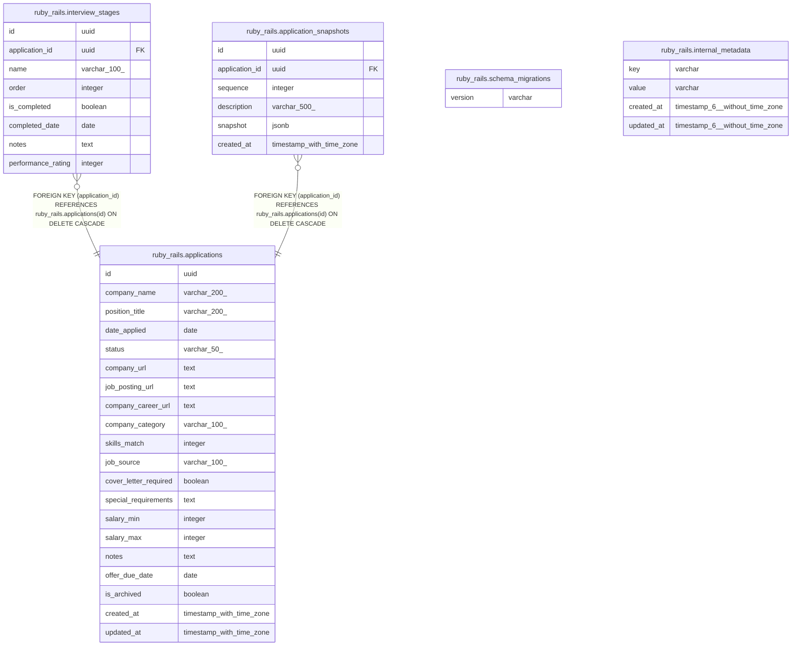

# app_tracker

## Tables

| Name | Columns | Comment | Type |
| ---- | ------- | ------- | ---- |
| [ruby_rails.schema_migrations](ruby_rails.schema_migrations.md) | 1 |  | BASE TABLE |
| [ruby_rails.internal_metadata](ruby_rails.internal_metadata.md) | 4 |  | BASE TABLE |
| [ruby_rails.applications](ruby_rails.applications.md) | 20 |  | BASE TABLE |
| [ruby_rails.interview_stages](ruby_rails.interview_stages.md) | 8 |  | BASE TABLE |
| [ruby_rails.application_snapshots](ruby_rails.application_snapshots.md) | 6 |  | BASE TABLE |

## Relations

---

> Generated by [tbls](https://github.com/k1LoW/tbls)
