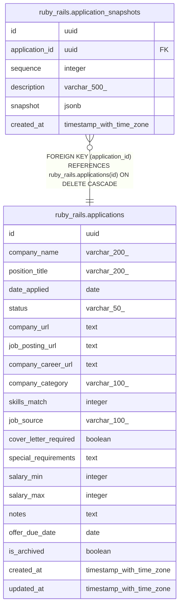

# ruby_rails.application_snapshots

## Columns

| Name | Type | Default | Nullable | Children | Parents | Comment |
| ---- | ---- | ------- | -------- | -------- | ------- | ------- |
| id | uuid | gen_random_uuid() | false |  |  |  |
| application_id | uuid |  | false |  | [ruby_rails.applications](ruby_rails.applications.md) |  |
| sequence | integer |  | false |  |  |  |
| description | varchar(500) |  | false |  |  |  |
| snapshot | jsonb |  | false |  |  |  |
| created_at | timestamp with time zone | now() | false |  |  |  |

## Constraints

| Name | Type | Definition |
| ---- | ---- | ---------- |
| application_snapshots_application_id_not_null | n | NOT NULL application_id |
| application_snapshots_created_at_not_null | n | NOT NULL created_at |
| application_snapshots_description_not_null | n | NOT NULL description |
| application_snapshots_id_not_null | n | NOT NULL id |
| application_snapshots_sequence_not_null | n | NOT NULL sequence |
| application_snapshots_snapshot_not_null | n | NOT NULL snapshot |
| application_snapshots_application_id_fkey | FOREIGN KEY | FOREIGN KEY (application_id) REFERENCES ruby_rails.applications(id) ON DELETE CASCADE |
| application_snapshots_pkey | PRIMARY KEY | PRIMARY KEY (id) |

## Indexes

| Name | Definition |
| ---- | ---------- |
| application_snapshots_pkey | CREATE UNIQUE INDEX application_snapshots_pkey ON ruby_rails.application_snapshots USING btree (id) |
| index_ruby_rails_application_snapshots_on_application_sequence | CREATE UNIQUE INDEX index_ruby_rails_application_snapshots_on_application_sequence ON ruby_rails.application_snapshots USING btree (application_id, sequence) |
| index_ruby_rails_application_snapshots_on_created_at | CREATE INDEX index_ruby_rails_application_snapshots_on_created_at ON ruby_rails.application_snapshots USING btree (created_at) |

## Relations

---

> Generated by [tbls](https://github.com/k1LoW/tbls)
