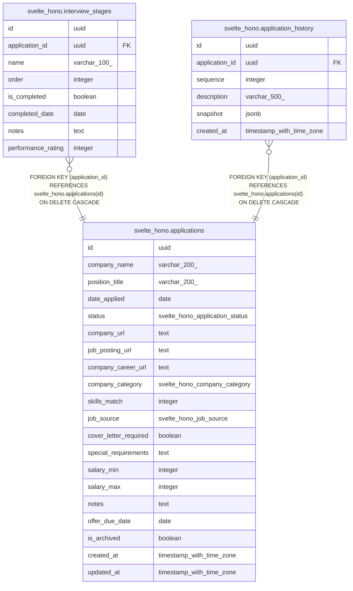

# svelte_hono.applications

## Columns

| Name | Type | Default | Nullable | Children | Parents | Comment |
| ---- | ---- | ------- | -------- | -------- | ------- | ------- |
| id | uuid |  | false | [svelte_hono.interview_stages](svelte_hono.interview_stages.md) [svelte_hono.application_history](svelte_hono.application_history.md) |  |  |
| company_name | varchar(200) |  | false |  |  |  |
| position_title | varchar(200) |  | false |  |  |  |
| date_applied | date |  | true |  |  |  |
| status | svelte_hono.application_status | 'unsubmitted'::svelte_hono.application_status | false |  |  |  |
| company_url | text |  | true |  |  |  |
| job_posting_url | text |  | true |  |  |  |
| company_career_url | text |  | true |  |  |  |
| company_category | svelte_hono.company_category |  | true |  |  |  |
| skills_match | integer |  | true |  |  |  |
| job_source | svelte_hono.job_source |  | true |  |  |  |
| cover_letter_required | boolean |  | true |  |  |  |
| special_requirements | text |  | true |  |  |  |
| salary_min | integer |  | true |  |  |  |
| salary_max | integer |  | true |  |  |  |
| notes | text |  | true |  |  |  |
| offer_due_date | date |  | true |  |  |  |
| is_archived | boolean | false | false |  |  |  |
| created_at | timestamp with time zone | now() | false |  |  |  |
| updated_at | timestamp with time zone | now() | false |  |  |  |

## Constraints

| Name | Type | Definition |
| ---- | ---- | ---------- |
| applications_company_name_not_null | n | NOT NULL company_name |
| applications_created_at_not_null | n | NOT NULL created_at |
| applications_id_not_null | n | NOT NULL id |
| applications_is_archived_not_null | n | NOT NULL is_archived |
| applications_position_title_not_null | n | NOT NULL position_title |
| applications_status_not_null | n | NOT NULL status |
| applications_updated_at_not_null | n | NOT NULL updated_at |
| applications_pkey | PRIMARY KEY | PRIMARY KEY (id) |

## Indexes

| Name | Definition |
| ---- | ---------- |
| applications_pkey | CREATE UNIQUE INDEX applications_pkey ON svelte_hono.applications USING btree (id) |

## Relations

---

> Generated by [tbls](https://github.com/k1LoW/tbls)
