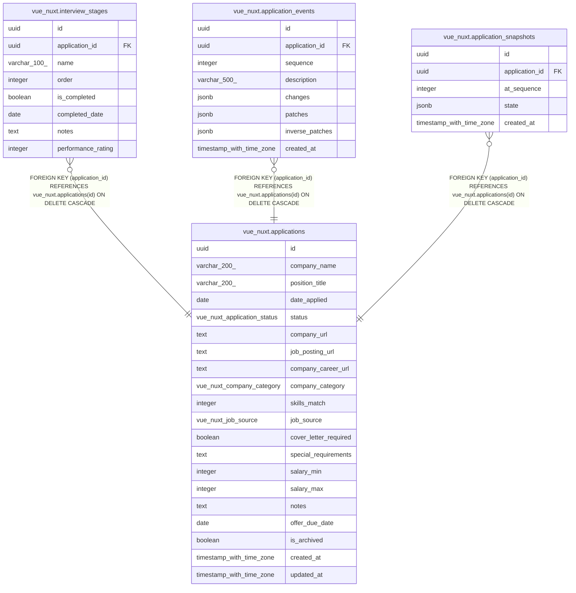

# app_tracker

## Tables

| Name | Columns | Comment | Type |
| ---- | ------- | ------- | ---- |
| [vue_nuxt.applications](vue_nuxt.applications.md) | 20 |  | BASE TABLE |
| [vue_nuxt.interview_stages](vue_nuxt.interview_stages.md) | 8 |  | BASE TABLE |
| [vue_nuxt.application_events](vue_nuxt.application_events.md) | 8 |  | BASE TABLE |
| [vue_nuxt.application_snapshots](vue_nuxt.application_snapshots.md) | 5 |  | BASE TABLE |

## Enums

| Name | Values |
| ---- | ------- |
| express_prisma.ApplicationStatus | accepted, applied, interviewing, offered, rejected, unsubmitted |
| express_prisma.CompanyCategory | enterprise, mid_market, other, scale_up, startup |
| express_prisma.JobSource | company_website, job_board, other, recruiter, referral |
| react_koa.application_status | accepted offer, applied, declined offer, given offer, interviewing, no offer, rejected |
| react_koa.company_category | ai, climate, consulting, consumer-tech, cybersecurity, e-commerce, education, energy, enterprise-software, finance, gaming, government, health, hospitality, media-entertainment, nonprofit, other, restaurant, retail |
| react_koa.job_source | colleague, company-website, friend, indeed, linkedin, other, recruiter |
| svelte_hono.application_status | accepted offer, applied, declined offer, given offer, interviewing, no offer, rejected |
| svelte_hono.company_category | ai, climate, consulting, consumer-tech, cybersecurity, e-commerce, education, energy, enterprise-software, finance, gaming, government, health, hospitality, media-entertainment, nonprofit, other, restaurant, retail |
| svelte_hono.job_source | colleague, company-website, friend, indeed, linkedin, other, recruiter |
| vue_nuxt.application_status | accepted offer, applied, declined offer, given offer, interviewing, no offer, rejected |
| vue_nuxt.company_category | ai, climate, consulting, consumer-tech, cybersecurity, e-commerce, education, energy, enterprise-software, finance, gaming, government, health, hospitality, media-entertainment, nonprofit, other, restaurant, retail |
| vue_nuxt.job_source | colleague, company-website, friend, indeed, linkedin, other, recruiter |

## Relations

---

> Generated by [tbls](https://github.com/k1LoW/tbls)
