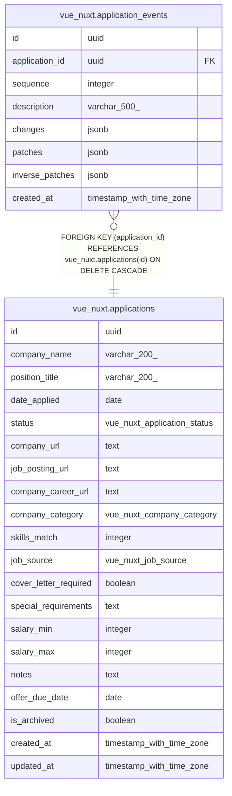

# vue_nuxt.application_events

## Columns

| Name | Type | Default | Nullable | Children | Parents | Comment |
| ---- | ---- | ------- | -------- | -------- | ------- | ------- |
| id | uuid |  | false |  |  |  |
| application_id | uuid |  | false |  | [vue_nuxt.applications](vue_nuxt.applications.md) |  |
| sequence | integer |  | false |  |  |  |
| description | varchar(500) |  | false |  |  |  |
| changes | jsonb |  | false |  |  |  |
| patches | jsonb |  | false |  |  |  |
| inverse_patches | jsonb |  | false |  |  |  |
| created_at | timestamp with time zone | now() | false |  |  |  |

## Constraints

| Name | Type | Definition |
| ---- | ---- | ---------- |
| application_events_application_id_not_null | n | NOT NULL application_id |
| application_events_changes_not_null | n | NOT NULL changes |
| application_events_created_at_not_null | n | NOT NULL created_at |
| application_events_description_not_null | n | NOT NULL description |
| application_events_id_not_null | n | NOT NULL id |
| application_events_inverse_patches_not_null | n | NOT NULL inverse_patches |
| application_events_patches_not_null | n | NOT NULL patches |
| application_events_sequence_not_null | n | NOT NULL sequence |
| application_events_application_id_applications_id_fk | FOREIGN KEY | FOREIGN KEY (application_id) REFERENCES vue_nuxt.applications(id) ON DELETE CASCADE |
| application_events_pkey | PRIMARY KEY | PRIMARY KEY (id) |
| application_events_application_id_sequence_unique | UNIQUE | UNIQUE (application_id, sequence) |

## Indexes

| Name | Definition |
| ---- | ---------- |
| application_events_pkey | CREATE UNIQUE INDEX application_events_pkey ON vue_nuxt.application_events USING btree (id) |
| application_events_application_id_sequence_unique | CREATE UNIQUE INDEX application_events_application_id_sequence_unique ON vue_nuxt.application_events USING btree (application_id, sequence) |

## Relations

---

> Generated by [tbls](https://github.com/k1LoW/tbls)
