# User Flows

This document defines the key user journeys through the application using flow diagrams.

---

## Flow 1: Add New Application

**Goal**: User records a new job application they've submitted.

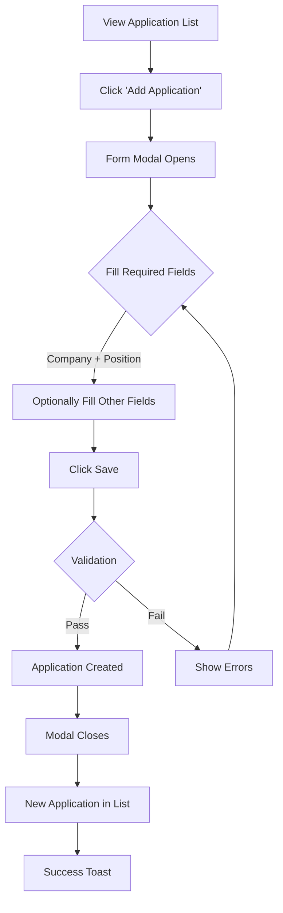

### Steps

1. User is on the Application List screen
2. User clicks "Add Application" button
3. Modal opens with empty form (status defaults to Unsubmitted, date applied is empty)
4. User enters required fields (company name, position title); date applied and status can be changed from defaults
5. User optionally fills additional fields
6. User clicks "Save"
7. System validates input
   - If valid: Creates application, closes modal, shows in list
   - If invalid: Shows validation errors, user corrects
8. User sees success confirmation

---

## Flow 2: Update Application Status

**Goal**: User moves an application through the hiring pipeline.

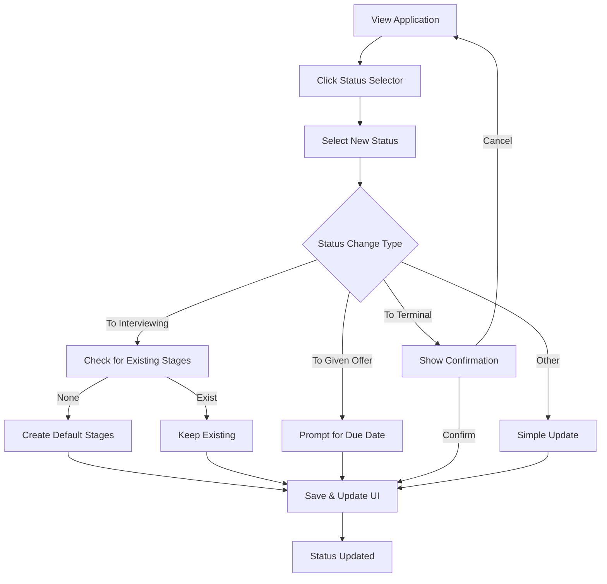

### Steps

1. User views an application
2. User clicks on status to change it
3. User selects new status from dropdown
4. System handles status-specific logic:
   - **→ Interviewing**: Create default interview stages if none exist
   - **→ Given Offer**: Optionally prompt for offer due date
   - **→ Terminal (Accepted/Declined)**: Show confirmation warning
5. System saves the change
6. UI updates to reflect new status

---

## Flow 3: Track Interview Progress

**Goal**: User marks interview stages as complete and adds notes.

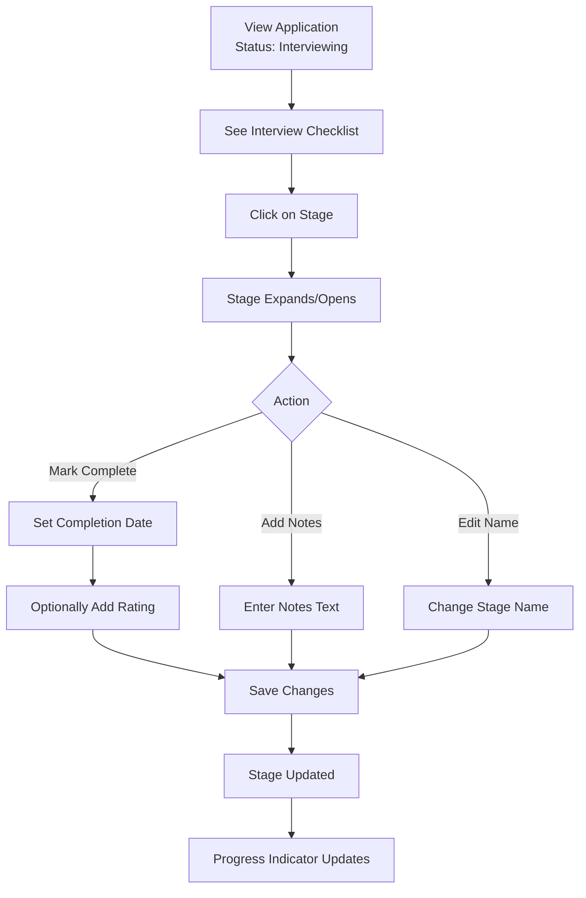

### Steps

1. User views application in "Interviewing" status
2. User sees checklist of interview stages
3. User clicks on a stage to interact
4. User can:
   - Mark stage as complete (with date)
   - Add performance rating (1-5)
   - Add notes about the interview
   - Rename the stage
5. Changes are saved
6. Progress indicator updates (e.g., "3/6 complete")

---

## Flow 4: Manage Interview Stages

**Goal**: User customizes the interview process for a specific application.

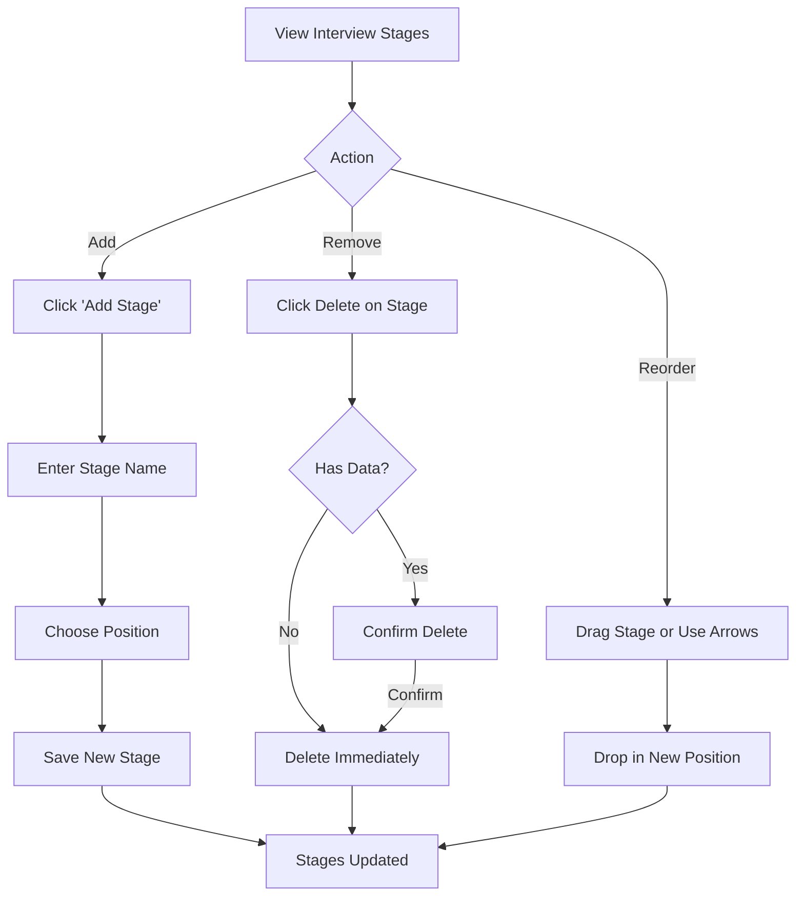

### Steps

**Add Stage:**
1. User clicks "Add Stage"
2. User enters stage name
3. User chooses where to insert (beginning, end, or specific position)
4. Stage is added to the list

**Remove Stage:**
1. User clicks delete on a stage
2. If stage has notes/ratings, confirm deletion
3. Stage is removed, others reorder

**Reorder Stages:**
1. User drags a stage to a new position (or uses up/down arrows)
2. Stage order updates
3. Order numbers are recalculated

---

## Flow 5: Filter and Sort Applications

**Goal**: User finds specific applications in their list.

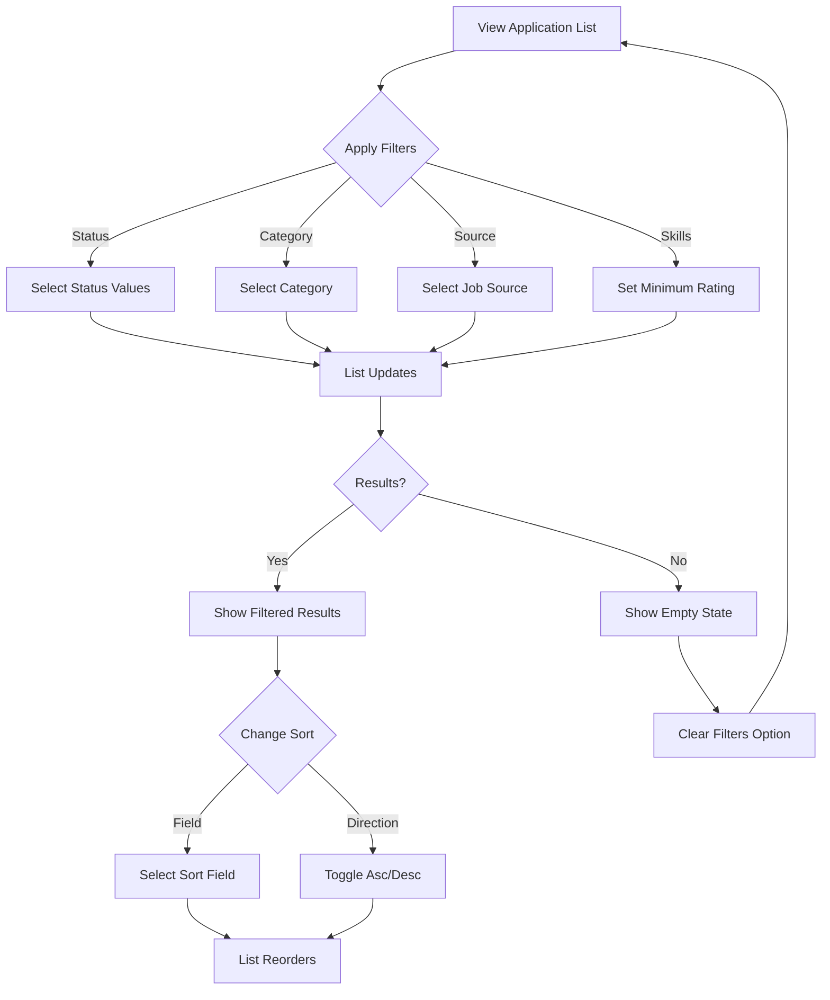

### Steps

1. User is on Application List
2. User applies one or more filters:
   - Status: Select one or more statuses
   - Category: Select a company category
   - Source: Select a job source
   - Skills: Set minimum skills match
3. List immediately updates to show matches
4. If no results, show empty state with "Clear Filters"
5. User can change sort order (field and direction)
6. List reorders accordingly

---

## Flow 6: Archive and Restore Application

**Goal**: User hides old applications and optionally retrieves them.

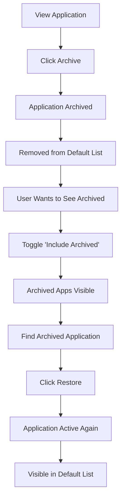

### Steps

**Archive:**
1. User views or selects an application
2. User clicks "Archive"
3. Application is marked as archived
4. Application disappears from default list view

**Restore:**
1. User toggles "Include Archived" filter
2. User sees archived applications (visually distinct)
3. User clicks "Restore" on archived application
4. Application becomes active again
5. Application appears in default list

---

## Flow 7: Delete Application

**Goal**: User permanently removes an application.

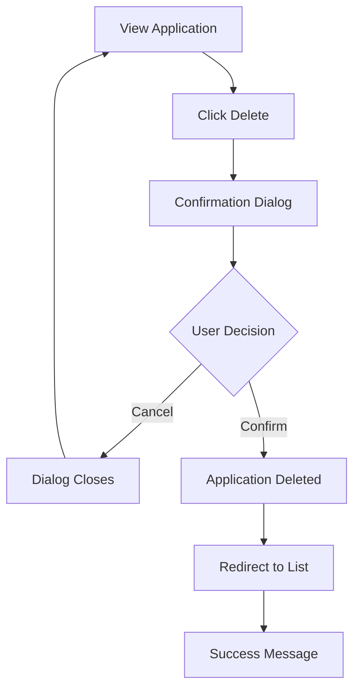

### Steps

1. User views an application
2. User clicks "Delete"
3. Confirmation dialog appears with warning
4. User confirms deletion
5. Application and all stages are permanently removed
6. User is redirected to list
7. Success message displayed

---

## Flow 8: Respond to Offer

**Goal**: User accepts or declines a job offer.

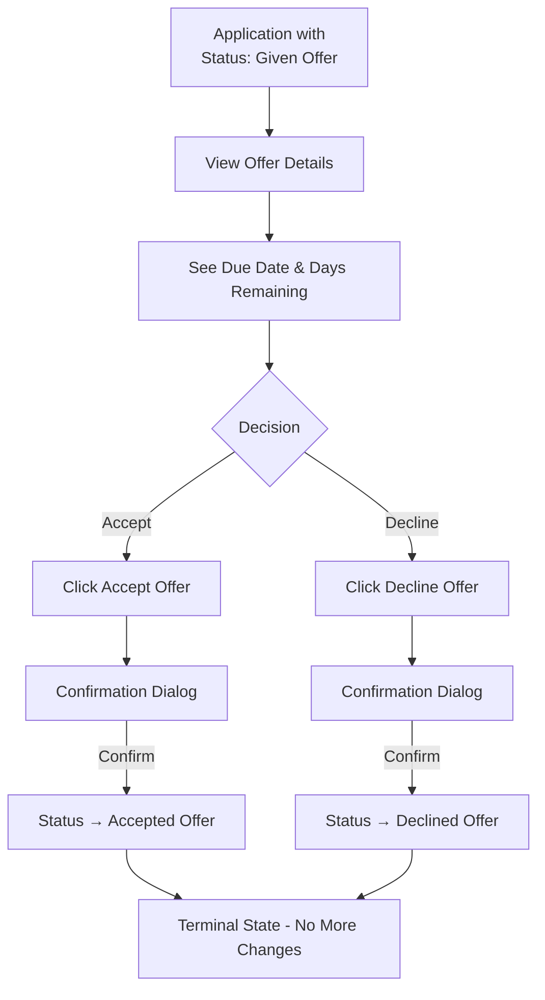

### Steps

1. User views application with "Given Offer" status
2. User sees offer due date and days remaining
3. User decides to accept or decline
4. User clicks appropriate button
5. Confirmation dialog warns of terminal state
6. User confirms
7. Status changes to terminal state
8. No further status changes possible

---

## Flow 9: First-Time User Experience

**Goal**: New user understands and starts using the tracker.

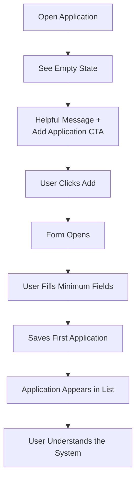

### Steps

1. New user opens the application
2. Empty state shows welcoming message
3. Clear call-to-action to add first application
4. User adds their first application
5. Application appears in list
6. User understands the basic workflow

---

## Flow 10: View and Restore Application History

**Goal**: User reviews past changes to an application and optionally restores a previous version.

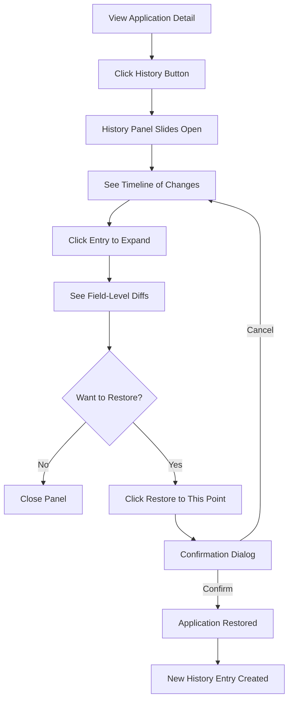

### Steps

1. User views an application detail page
2. User clicks "History" button in the header
3. Side panel slides open showing change timeline (newest first)
4. User clicks an entry to expand field-level diffs
5. User sees old values (struck-through) and new values
6. User optionally clicks "Restore to this point"
7. Confirmation dialog appears
8. On confirm: application reverts to that snapshot's state
9. New "Restored to version N" entry appears in history
10. History panel updates to show the restore entry

---

## Flow 11: Import Applications from CSV

**Goal**: User bulk-creates applications by uploading a CSV file.

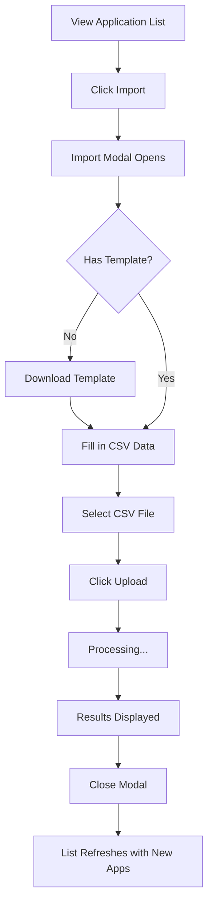

### Steps

1. User clicks "Import" button on the application list
2. Import modal opens with file picker
3. Optionally: user downloads template CSV for reference
4. User selects a CSV file from their computer
5. System uploads and processes the file row-by-row
6. Modal displays results: N imported, N skipped (duplicates), N errors
7. Errors show row number and description
8. User closes modal
9. Application list refreshes to include newly imported applications

---

## Flow 12: Export Applications to CSV

**Goal**: User downloads all applications as a CSV file.

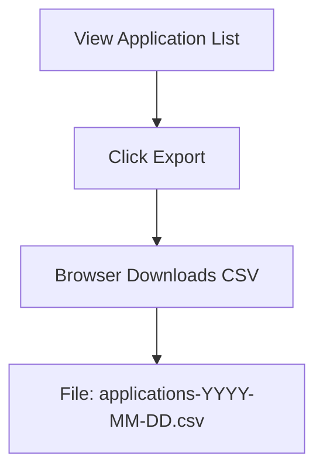

### Steps

1. User clicks "Export" button on the application list
2. Browser downloads a CSV file named `applications-YYYY-MM-DD.csv`
3. CSV contains all applications (active and archived) with 16 columns
4. Interview stages are excluded from the export (too complex for flat CSV)

---

## Error Flows

### Network Error During Save

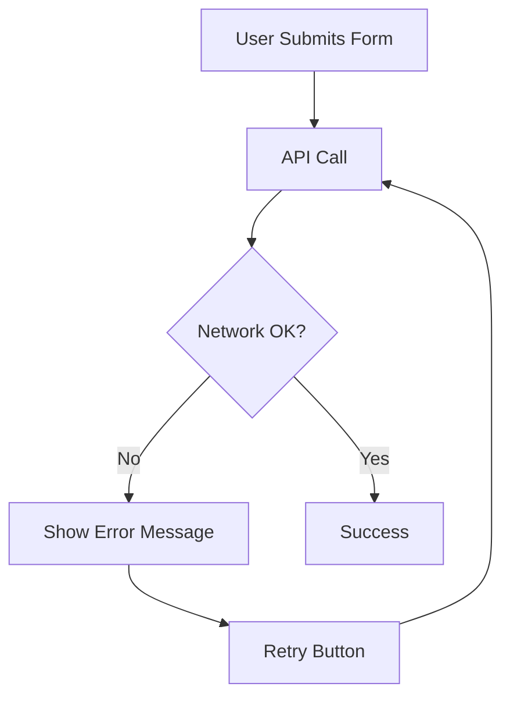

### Validation Error

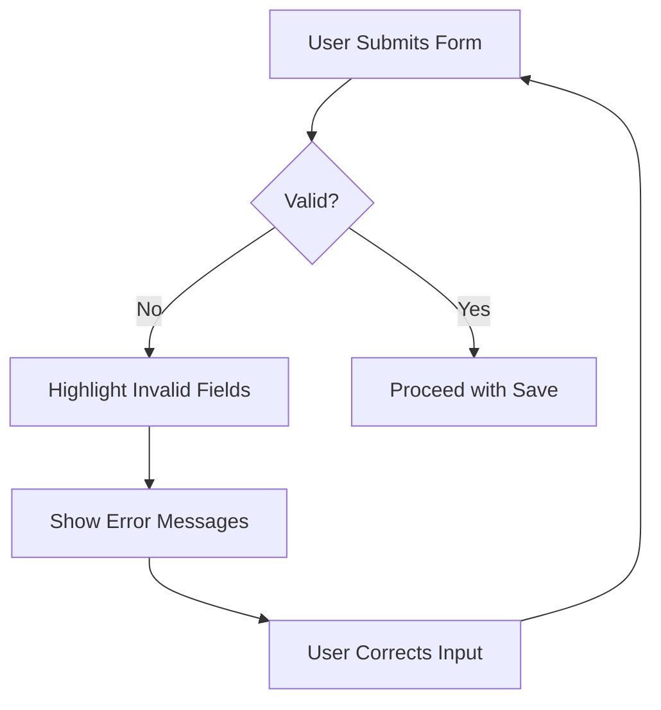

### Not Found Error

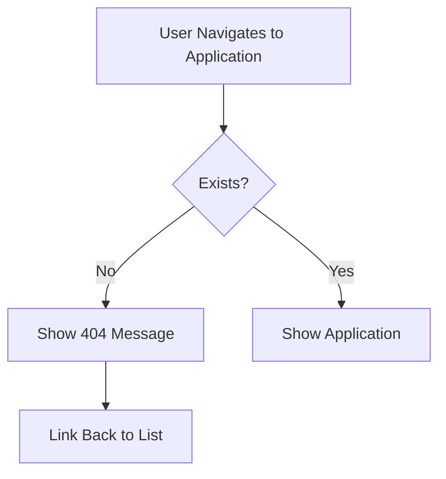

---

## Keyboard Navigation

### Global Shortcuts (Optional)

| Key | Action |
|-----|--------|
| `n` | New application (when list focused) |
| `/` | Focus search/filter |
| `Esc` | Close modal/dialog |

### Modal Navigation

| Key | Action |
|-----|--------|
| `Tab` | Move to next field |
| `Shift+Tab` | Move to previous field |
| `Enter` | Submit form (when button focused) |
| `Esc` | Cancel/close modal |

### List Navigation

| Key | Action |
|-----|--------|
| `↑/↓` | Move selection |
| `Enter` | Open selected |
| `Delete` | Delete selected (with confirm) |
